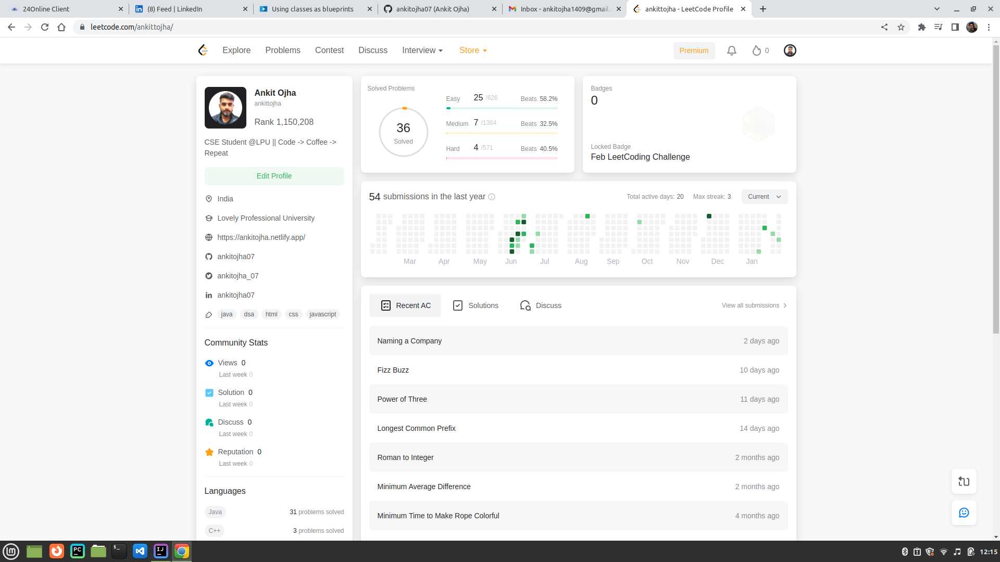

# Leetcode-ankittojha
Practice of Data Structures and Algorithms with Java programming language.
### How it Started?
Ankit Ojha Leetcode Submission Chart Till June 2022

 

# -------------- Restarted on 11 Feb 2023 --------------
## Starting with OOPs Concepts [11-02-2023]
- Classes and Objects
- Encapsulation
- Inheritance
- Polymorphism
- Abstraction

