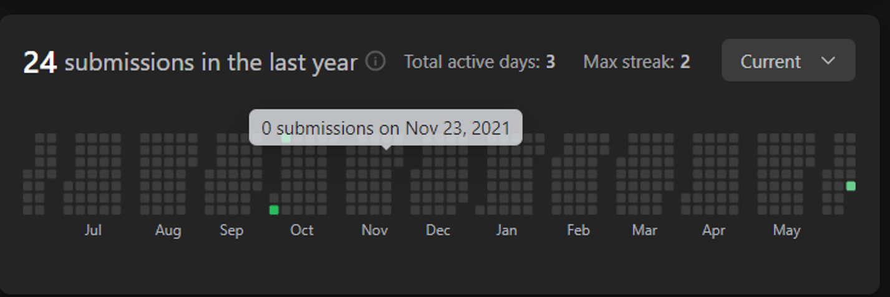

# Leetcode-ankittojha
Practice of Data Structures and Algorithms with Java programming language.
### How it Started?
Ankit Ojha Leetcode Submission Chart Till June 2022

 

## Date wise practice update :
### 17 June 2022
1 - src > Algorithms : [Binary Search](https://github.com/ankittojha/Leetcode-ankittojha/blob/master/src/Algorithms/BinarySearch.java)

### 18 June 2022
1- [Min Cost Climbing Stairs problem ](https://github.com/ankittojha/JAVA-DSA-ankittojha/blob/master/src/DP21DaysLeetCode/MinCostClimbingStairs.java)  (DP) 
 
2- [Running sum of 1D Array](https://github.com/ankittojha/JAVA-DSA-ankittojha/blob/master/src/Arrays/RunningSum1DArray.java) Array Problem
 
3- 